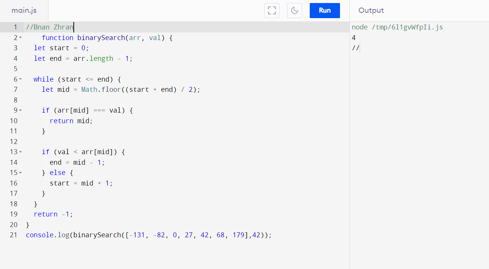
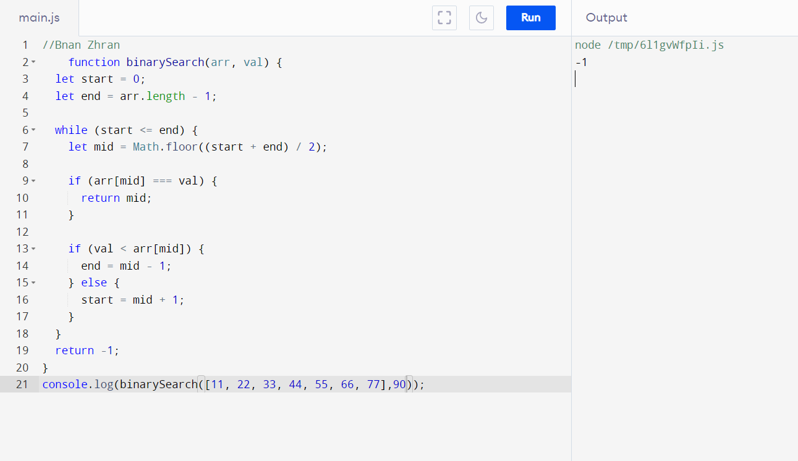
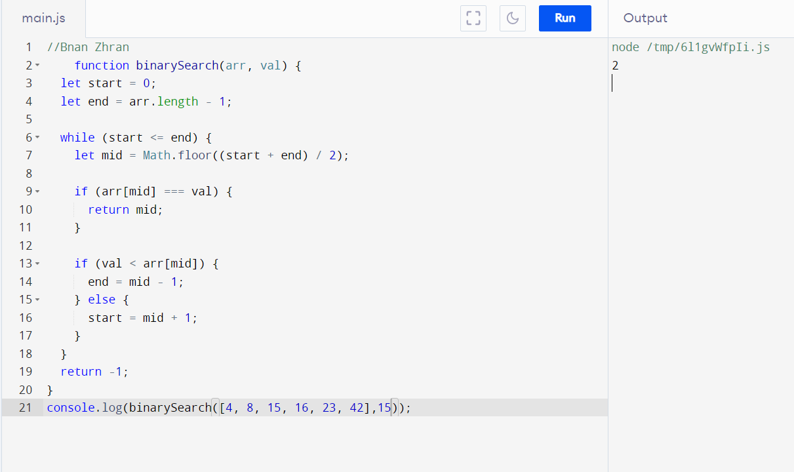
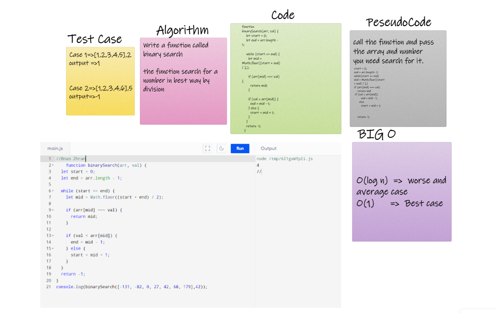

# Binary Search
## This method take 2 value(array and number) and search on number in the array

## old way that mak for loop and search if number in array or not
## in binary search the function devided the length of the array and search this index have a number that i need or lees or big

## In this way search operation will take under than half time than old way

### this pictur to clarification method ...

