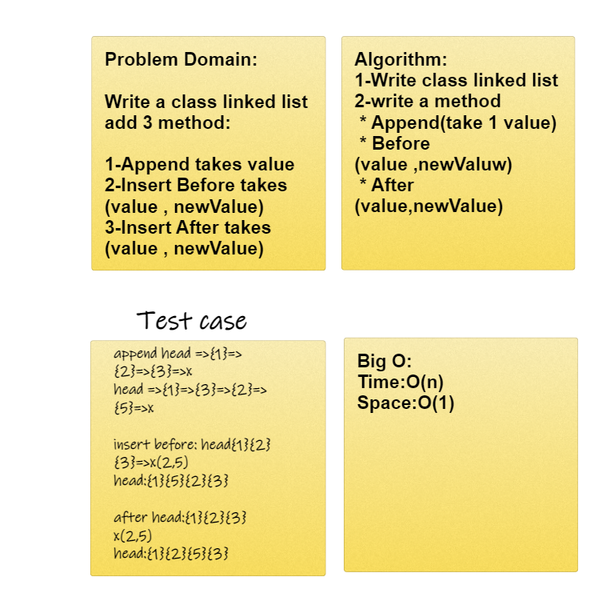

# Code chalenge class 06

## Challenge:
* create a linked list class that has methods to append, insert before, and insert after nodes.

## Approach & Efficiency:
* The Big O time is O(n)
* Space is O(1)

## WhiteBoard:
