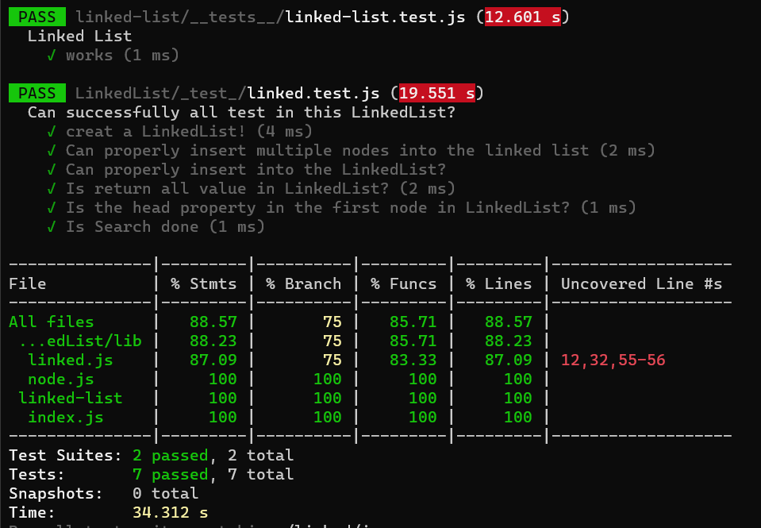

# Singly Linked List

## LinkedList :
 A linked list is a linear data structure, in which the elements are not stored at contiguous memory locations. The elements in a linked list are linked using pointersas shown in the below image:

 

 In simple words, a linked list consists of nodes where each node contains a data field and a reference(link) to the next node in the list.
### Topic
* Singly Linked List
* Circular Linked List
* Doubly Linked List
* Misc
* Quick Links

 ## What i learned in this challenge:
I leaned hoe can i create a linked list and how added a tail.

## Test driven :
- Create a LinkedList!
- Can properly insert multiple nodes into the linked list
- Can properly insert into the LinkedList?
- Is return all value in LinkedList?
- Is the head property in the first node in LinkedList?
- Is Search done

# Approach & Efficiency:

* Used Classes to implement the linked list with the O(1) and O(n) from data strucher that i leaned in past class for it methods .

