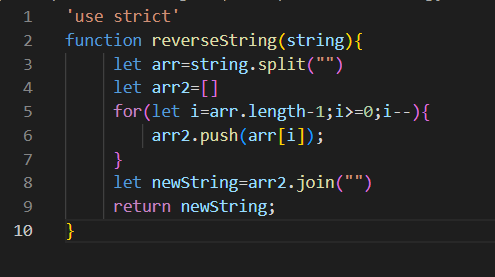

## Reverse an Array 

* we made a function called reverseString which takes an String  and converte it into array .

## Whiteboard Process: 

## Approach & Efficiency:
1.used for loop to revers the String with push and join method. 
2.The Big O time is O(n) and / Space is O(1)

[Back to Code Challenge Folder](../../code-challenges/)
