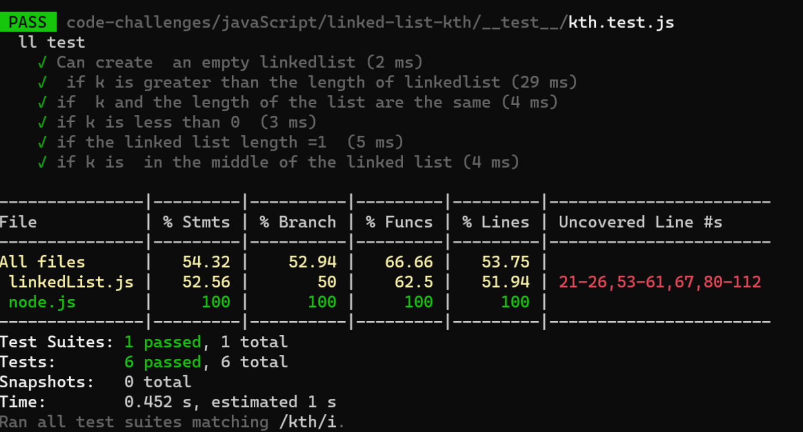
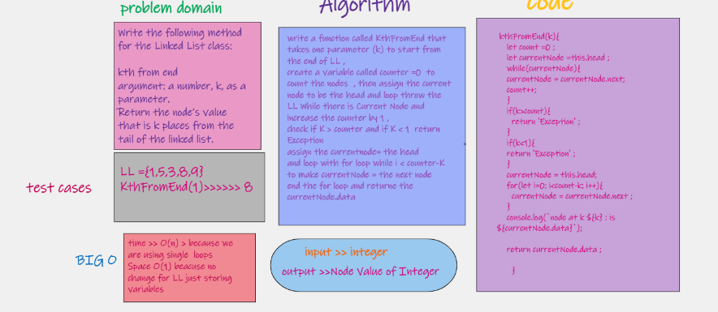

# Linked List Kth From End
need to create a link list constructor class along with method to do the desired search action

## Challenge
create a linked list class that has a method to append nodes simply to have something to work with and a method used to search for specific nodes in the linke list and return the value

## Approach & Efficiency:
* The Big O time is O(n)
* Space is O(1)
* ll.kth ll kth test

WhiteBoard:
